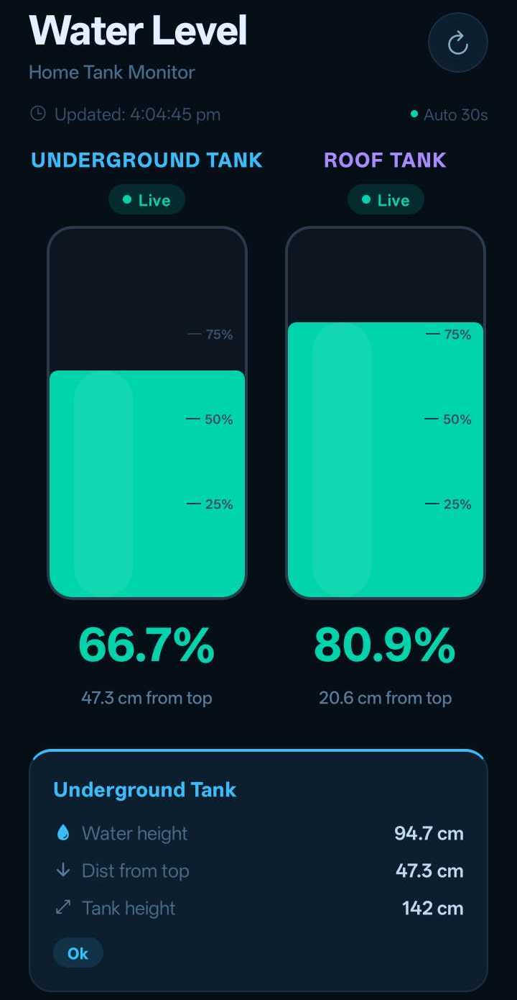
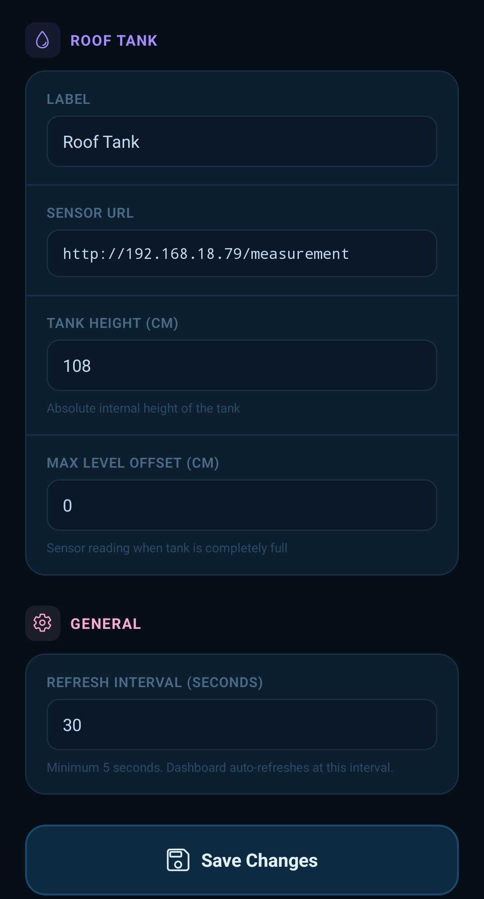

# Smart Water Level Inspector 🚰💧

An open-source DIY dual-tank water level monitoring system designed for homes. The project measures water levels in two separate tanks—an **Underground Tank (UG)** and a **Roof Tank**—using waterproof ultrasonic sensors, coordinates data via a central ESP8266 Master node, displays live states on an I2C LCD with LED alarm indicators, and broadcasts data to a modern React Native (Expo) Android mobile dashboard.

---

## 💡 Key Design Advantages

* **Non-Contact Measurement (No physical contact with water):** Traditional float switches or resistive sensor probes corrode over time, get stuck due to scaling, or contaminate clean water. The waterproof ultrasonic transceivers (AJ-SR04T / JSN-SR04T) are mounted securely above the maximum water level. They never physically touch the liquid, guaranteeing zero sensor corrosion, absolute food-safe tank conditions, and exceptional mechanical longevity.
* **Edge-Level Data Processing & Error Filtering:** Instead of doing complex calculations, thresholding, and calibrations directly on the sensor node, the Slave nodes only emit raw, unfiltered distance readings. The heavy lifting (calibration, offset subtraction, constraints, percentage calculation, error checking, and filtering) is processed on the receiving ends (the central Master Node and the React Native App). This separation of concerns allows us to easily filter out transient measurement spikes and update tank height calibrations on the fly without needing to re-flash the physical sensor nodes.

---

## 🏗️ System Architecture


The project consists of three main components:
1. **ESP8266 Slave Nodes (x2):** Placed at each water tank. They measure the water level (distance to water surface) using AJ-SR04T / JSN-SR04T waterproof ultrasonic sensors and expose a simple `/measurement` HTTP server endpoint.
2. **ESP8266 Master Node:** Central processing unit inside the home. It periodically queries the Slave nodes via HTTP, handles display rendering on a 16x2 I2C LCD, blinks status indicator LEDs, detects water flow trends (rising levels), and has a physical push button for instant refreshing.
3. **Android Dashboard Application:** A modern React Native + Expo app that connects to the same network, pulling data directly from the nodes to display a gorgeous real-time visual water gauge and advanced tank metrics.

```mermaid
graph TD
    subgraph "Water Tanks (Slaves)"
        S1[Slave 1: UG Tank<br>ESP8266 + AJ-SR04T]
        S2[Slave 2: Roof Tank<br>ESP8266 + AJ-SR04T]
    }

    subgraph "Central Controller (Master)"
        M[Master Node<br>ESP8266]
        LCD[I2C LCD 16x2 Display]
        LEDs[Status LEDs<br>Red, Yellow, Green]
        Btn[Manual Refresh Button]
        
        M --> LCD
        M --> LEDs
        Btn --> M
    end

    subgraph "Mobile Client"
        App[Expo / React Native App<br>Android Dashboard]
    end

    S1 -- "HTTP GET /measurement (WiFi)" --> M
    S2 -- "HTTP GET /measurement (WiFi)" --> M
    S1 -- "HTTP GET /measurement" --> App
    S2 -- "HTTP GET /measurement" --> App
```

---

## 🛠️ Hardware Parts List

To build this DIY system, you will need the following components:

| Component | Description | Quantity |
| :--- | :--- | :---: |
| **JSN-SR04T / AJ-SR04T** | Waterproof Ultrasonic Sensor Module with transducer probe (highly recommended for humid tanks) | 2 |
| **ESP8266 Development Board** | NodeMCU V3 or Wemos D1 Mini | 3 |
| **Resistors (2.2kΩ and 3.3kΩ)** | Voltage divider resistors for each Slave Node's Echo pin (translates 5V output to 3.3V logic) | 2 each |
| **I2C LCD 16x2 Display** | LiquidCrystal character display with I2C backpack interface | 1 |
| **Status LEDs** | Alarm indicators (1x Red, 1x Yellow, 1x Green) | 3 |
| **Push Button** | Momentary tactile switch for manual display refresh | 1 |
| **5V Power Supply** | Reliable USB adapter or 5V DC step-down module (minimum 1A per node) | 3 |
| **Connecting Wires & Enclosure**| Jumper wires, breadboard/PCB, and weatherproof enclosures | - |

---

## 🔌 Circuit Connections & Wiring


### ⚡ Critical Design Note: 3.3V vs 5V Logic
The **JSN-SR04T / AJ-SR04T** sensor operates on **5V VCC** and outputs a **5V logic pulse** on its `Echo` pin. However, the **ESP8266 microcontrollers operate strictly on 3.3V logic**. 

Applying a 5V signal directly to an ESP8266 GPIO pin can permanently damage the chip. To prevent this, you **must** use a simple voltage divider to step down the 5V `Echo` signal to a safe 3.3V level.

#### Echo Pin Voltage Divider Schematic:
```text
JSN-SR04T Echo Out (5V) -------- [ 2.2kΩ Resistor ] -------- ESP8266 GPIO Pin (3.3V input)
                                                    |
                                            [ 3.3kΩ Resistor ]
                                                    |
                                                   GND
```
*Voltage Calculation:* $V_{out} = 5\text{V} \times \left( \frac{3.3\text{k}\Omega}{2.2\text{k}\Omega + 3.3\text{k}\Omega} \right) = 3.0V$, which is safely inside the logic high range for ESP8266.

---

### 1. Slave Node Wiring (Tank 1 & Tank 2)

| JSN-SR04T Pin | ESP8266 NodeMCU Pin | Notes |
| :--- | :--- | :--- |
| **VCC** | **5V / VIN** | Must power sensor with 5V for reliable readings |
| **Trig** | **D1 (GPIO 5)** | Standard trigger output |
| **Echo** | **D2 (GPIO 4)** | **Via 2.2k / 3.3k Voltage Divider** (Do NOT connect directly!) |
| **GND** | **GND** | Common ground reference |

---

### 2. Master Node Wiring (Central Display)

| Component | Component Pin | ESP8266 NodeMCU Pin | Notes |
| :--- | :--- | :--- | :--- |
| **I2C LCD 16x2** | VCC | 5V / VIN | Power for backlight |
| **I2C LCD 16x2** | GND | GND | Common ground |
| **I2C LCD 16x2** | SDA | **D6 (GPIO 12)** | I2C Data pin |
| **I2C LCD 16x2** | SCL | **D7 (GPIO 13)** | I2C Clock pin |
| **Yellow LED** | Anode (+) | **D1 (GPIO 5)** | Alarm for Underground Tank (through resistor) |
| **Red LED** | Anode (+) | **D2 (GPIO 4)** | Alarm for Roof Tank (through resistor) |
| **Green LED** | Anode (+) | **D5 (GPIO 14)** | Level rising & stable status (through resistor) |
| **Refresh Button**| Terminal A | **D3 (GPIO 0)** | Standard tactile switch (uses internal pull-up) |
| **Refresh Button**| Terminal B | GND | Connects D3 to Ground when pressed |

---

## 💾 Firmware Setup (ESP8266 Sketches)

Sketches are built with Arduino IDE. Make sure you install the `ESP8266` board library and the `IskakINO_LiquidCrystal_I2C` library before compilation.

### Slave Node Configuration (`ESP8266_sketches/Slave_water_level_sensor`)
1. Open `Slave_water_level_sensor.ino`.
2. Configure Wi-Fi details:
   ```cpp
   const char* ssid = "Your_WiFi_SSID";
   const char* password = "Your_WiFi_Password";
   ```
3. Set a static IP for each slave to ensure consistent communication:
   ```cpp
   // Set to IPAddress(192, 168, XX, 101) for Slave 1, and (192, 168, XX, 102) for Slave 2
   IPAddress local_IP(192, 168, 1, 101);
   IPAddress gateway(192, 168, 1, 1);
   IPAddress subnet(255, 255, 255, 0);
   ```
4. Flash the code to the respective Slave boards.

### Master Node Configuration (`ESP8266_sketches/Master_water_level_sensor`)
1. Open `Master_water_level_sensor.ino`.
2. Set matching Wi-Fi credentials and a distinct static IP.
3. Configure your Slave Node URL endpoints:
   ```cpp
   const String slave1_URL = "http://192.168.1.101/measurement"; // Underground Tank
   const String slave2_URL = "http://192.168.1.102/measurement"; // Roof Tank
   ```
4. Define your physical tank heights (in cm) and sensor mounting offsets (distance from sensor to maximum fill level):
   ```cpp
   const float TANK1_HEIGHT = 142.0; 
   const float TANK2_HEIGHT = 108.0; 
   const float MAX_LEVEL_DISTANCE_TANK_1 = 29.56; // cm between sensor face and max water level
   const float MAX_LEVEL_DISTANCE_TANK_2 = 0.0;
   ```
5. Flash the code to the Master board.

#### 💡 Master Indicator LED Logic:
- **Yellow LED (UG Tank):** Glows solid if the UG Slave is offline; blinks rapidly when water drops below 20%; goes off when water level is safe.
- **Red LED (Roof Tank):** Glows solid if the Roof Slave is offline; blinks rapidly when water drops below 20%; goes off when level is safe.
- **Green LED (Status/Trend):** Blinks if the roof tank level is actively rising (filling); glows solid if the level is above 35% and stable; goes off when tank levels are low.

---

## 📱 Mobile Dashboard App (Expo / React Native)

The mobile app is a beautiful dark-mode interface built with React Native and Expo. It displays live animated water gauges, calculates volumetric differences, tracks connection statuses, and allows local configuration storage.

| Dashboard Screen | App Settings & Configuration |
| :---: | :---: |
|  |  |

### ✨ App Features
- **Smooth Animations:** Continuous custom liquid wave simulation and real-time transition physics using React Native Reanimated.
- **Live Status Badges:** Colors automatically change based on the level: Cyan for Safe (>35%), Orange for Warning (15-35%), and Red for Critical (<15%).
- **Error Handling:** Prominently alerts you in real-time if a sensor node goes offline on the network.
- **Persistent Local Config:** Set custom IP addresses, tank labels, total tank heights, offsets, and auto-refresh intervals within the app's context.

### 🚀 Running the App locally

1. Navigate to the mobile app directory:
   ```bash
   cd Android_application
   ```
2. Install dependencies:
   ```bash
   npm install
   ```
3. Start the Expo development server:
   ```bash
   npx expo start
   ```
4. Scan the QR code with your phone via the **Expo Go** app (Android) or camera app (iOS) to launch the dashboard instantly!

---

## 🚀 Future Development: Automated Tank Filling System

A natural next step for this project is setting up an **Automated Tank Filling System** by adding a pump relay controller connected to the central Master Node or a separate ESP8266. This automation will coordinate both tanks using the following logic:

### ⚙️ Automation & Safety Logic
* **Dry-Run Prevention (UG Tank Check):** The controller must check the Underground (UG) Tank level first. If the UG Tank level is below a safe threshold (e.g., <30%), the pump will be locked out and prevented from starting to avoid running the water pump dry and burning out the motor.
* **Auto-Fill Trigger (Roof Tank Check):** When the Roof Tank level drops below a set threshold (e.g., <20%), the controller activates a high-power relay module to turn on the water pump.
* **Auto-Shutoff:** The pump will run until the Roof Tank reaches its full capacity (e.g., >95%) or if the UG Tank level drops below the critical dry-run threshold.
* **Sensor Offline Fail-Safe:** If either Slave node goes offline on the network, the pump will automatically shut off immediately to prevent runaways and potential flooding.
* **Manual Override:** A physical override toggle or button in the mobile app interface will allow users to manually start or stop the pump at any time.

---

## 📜 License
This project is open-source and licensed under the [MIT License](LICENSE).